# ACRONIS BACKUP

A aplicação Acronis Backup é um projeto desenvolvido para a disciplina de Desenvolvimento Web, do curso de Redes de Computadores do Instituto Federal da Paraíba - IFPB. O objetivo do projeto é desenvolver uma aplicação web que permita o cadastro e autenticação de usuários onde um cada usuário terá um diretório com seu nome de usuário dentro do servidor de backup. Este serveidor deve ter suas credencias de acesso definidas pelo administrador do sistema dentro do arquivo .env do backend da aplicação.

O servidor de utilizado para backup deve ter o serviço SSH habilitado e o usuário de conexão deve ter permissão de escrita no diretório de backup. O servidor de backup pode ser um servidor local ou um servidor remoto, desde que o mesmo esteja acessível na rede. Todos os arquivos serão enviador por meio do protocolo SFTP (SSH File Transfer Protocol).

### Página de login da aplicação:

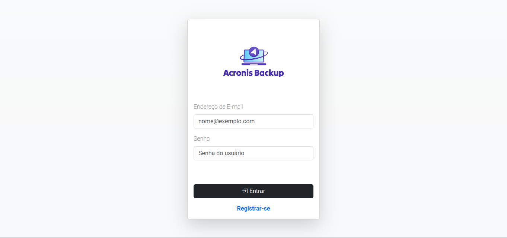

### Página de registro da aplicação:

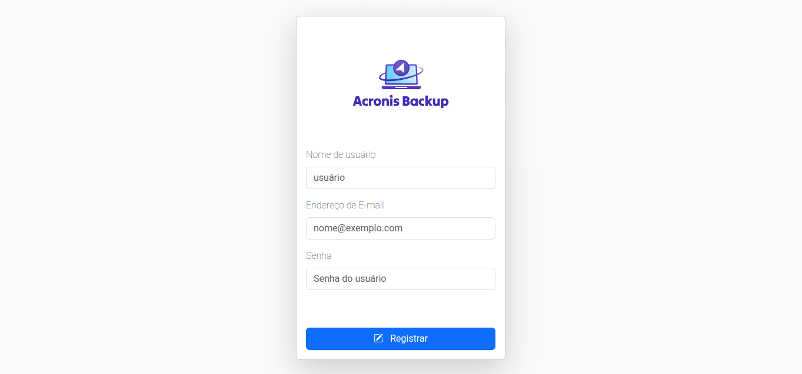

### Página inicial do usuário:

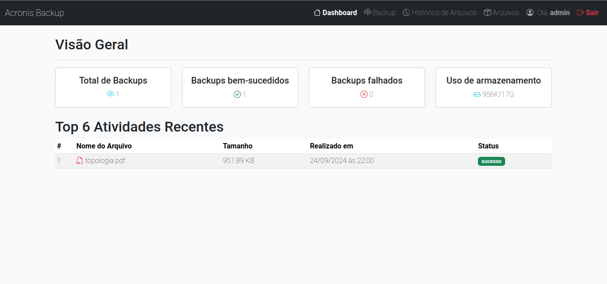

### Página de upload de arquivos:

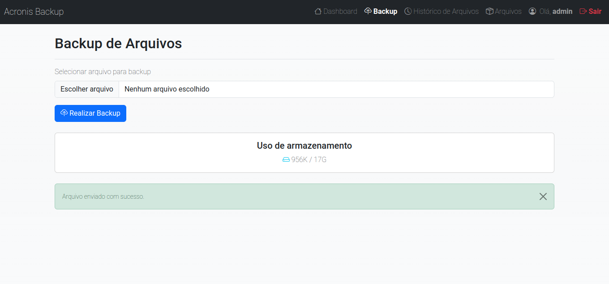

### Página de visualização de histórico de uploads:

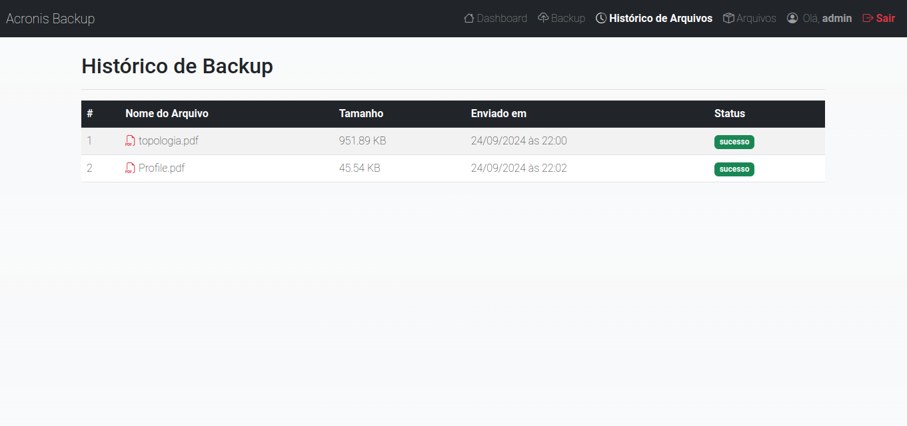

### Página de visualização de arquivos no diretório de backup do usuário dentro do servidor:

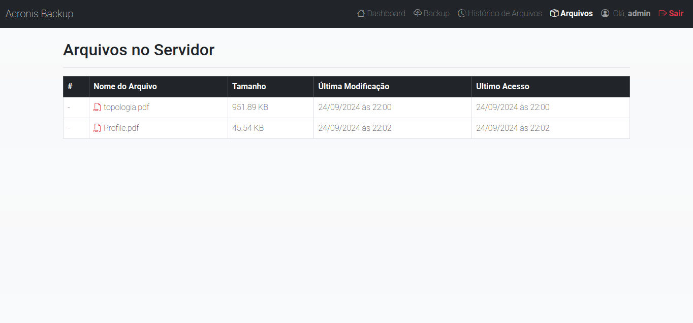

### Arquivos no diretório de backup do usuário dentro do servidor:

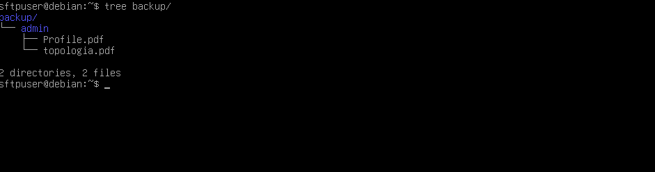

O backend da aplicação foi desenvolvido utilizando o framework Express.js (Node.js) e o ORM Prisma. Para garantir a segurança da aplicação, foi utilizado o JWT para autenticação de usuários. Ao registrar um novo usuário no sistema, o mesmo terá um diretório criado no servidor de backup com seu nome de usuário ao realizar o login. A aplicação também criptografa a senha do usuário antes de armazenar no banco de dados utilizando o Argon2, uma biblioteca de hash de senha. Para a conexão com o servidor de backup, foi utilizado o módulo ssh2-sftp-client.

* O Express.js é um framework web para Node.js que fornece uma série de recursos para a criação de aplicações web, como roteamento, middlewares, etc; 

* O Prisma é um ORM (Object-Relational Mapping) para Node.js e TypeScript que permite a interação com o banco de dados de forma mais fácil e segura; 

* O JWT (JSON Web Token) é um padrão aberto (RFC 7519) que define uma maneira compacta e autocontida para transmitir informações entre as partes como um objeto JSON; 

* O Argon2 é um algoritmo de hash de senha que é considerado seguro e resistente a ataques de força bruta;

* O ssh2-sftp-client é um módulo para Node.js que permite a conexão com servidores SFTP (SSH File Transfer Protocol).

#### Esquema de autenticação de usuário com JWT (JSON Web Token) representado em um diagrama de sequência:


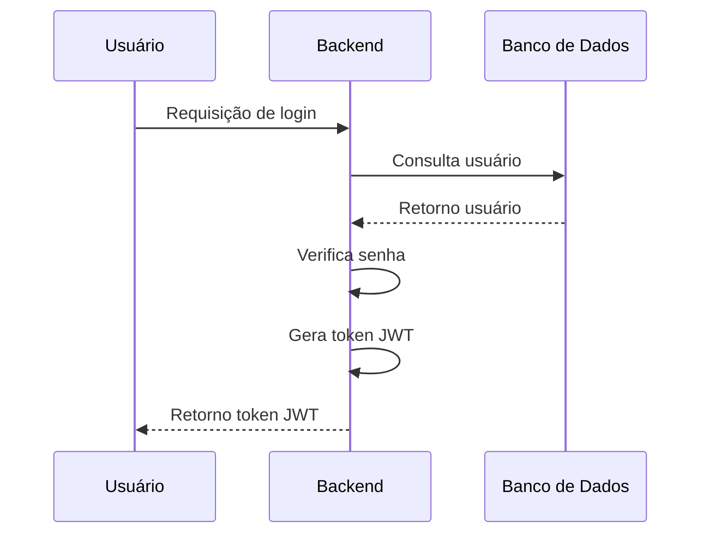

#### Esquema de criação de diretório de backup para usuário representado em um diagrama de sequência:
    
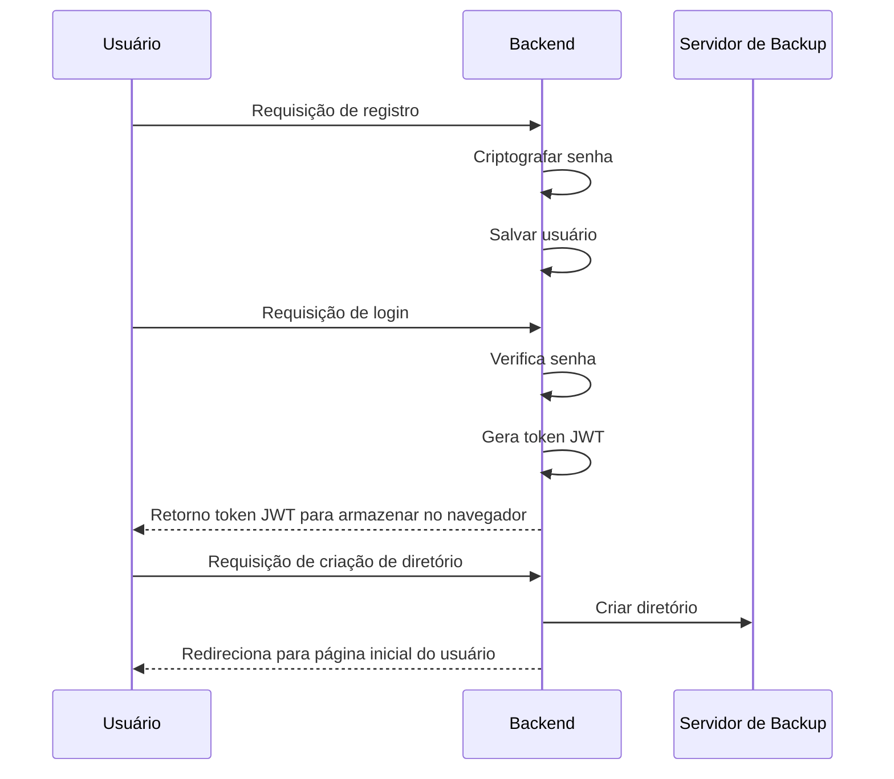
#

|Observação: Se o backend indentificar que já existe um diretório com o nome do usuário no servidor de backup, o mesmo não irá criar um novo diretório. Caso contrário, o backend irá criar um novo diretório com o nome do usuário no servidor de backup.|
---

#

Ao se autenticar na aplicação o usuário pode realizar o upload de arquivos para o seu diretório de backup dentro do servidor. O frontend da aplicação foi desenvolvido utilizando o vite.js, um bundler de aplicações web, e o html, css e javascript e Bootstrap para a construção da interface.

#

|Observação: O usuário só conseguirá entrar na aplicação se o servidor de backup definido no .env estiver online na rede|
---

#

Para realizar o upload de arquivos, o frontend da aplicação utiliza a API Fetch para enviar os arquivos para o backend. O backend da aplicação utiliza o multer, um middleware para manipulação de arquivos, para receber os arquivos enviados pelo frontend e salvar em um diretório temporário. Após salvar o arquivo e pegar algumas informações do arquivo com o multer, o backend da aplicação utiliza o módulo ssh2-sftp-client para realizar a conexão com o servidor de backup e enviar o arquivo para o diretório do usuário.

#### Esquema de upload de arquivo para o servidor de backup representado em um diagrama de sequência:


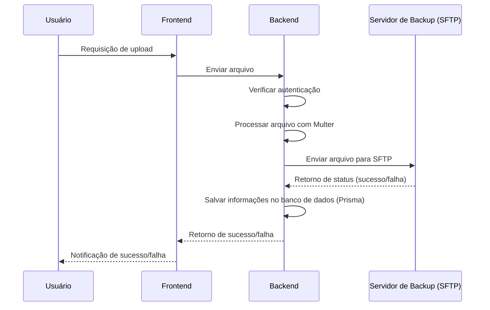
#

O multer é utilizado na aplicação para receber os arquivos enviados pelo frontend e salvar em um diretório temporário. Além disso, o multer também é utilizado para pegar algumas informações do arquivo, como nome, tamanho, mimetype, etc. Com essas informações podemos salvar um registro no banco de dados com as informações dos arquivos enviados pelo usuário.

#

|Observação: O backend da aplicação irá salvar o arquivo ssem um diretório temporário e após o envio do arquivo para o servidor de backup, o arquivo será deletado do diretório temporário. A cada 2 (dois) minutos, o backend da aplicação irá verificar se existe algum arquivo no diretório temporário e deletar o mesmo.|
---

#

A aplicação também permite que o usuário visualize os arquivos que estão no seu diretório de backup. O frontend da aplicação utiliza a API Fetch para fazer uma requisição ao backend e pegar a lista de arquivos do diretório do usuário. O backend da aplicação utiliza o módulo ssh2-sftp-client para realizar a conexão com o servidor de backup e listar os arquivos do diretório do usuário.

A aplicação também pega algumas informações necessárias para a visualização no frontend, como a utilização de disco no servidor de backup pelo usuário.

#### Esquema de requisição para pegar a informação de uso de disco do servidor de backup representado em um diagrama de sequência:

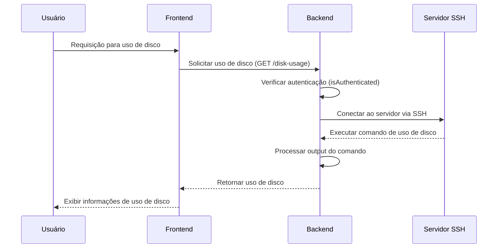

#### Exemplo de retorno em JSON da requisição de uso de disco do servidor de backup:

```json
{
	"diskUsage": {
		"tm_files": "84K",
		"tm_disk": "19G",
		"uso_disk": "1,3G",
		"free_disk": "17G",
		"percent_uso": "8%"
	}
}
```

#

Os comandos utilizados para pegar as informações de uso de disco do servidor de backup são:

```bash
du -sh backup/${username} && df -h backup/${username}
```

Saída do comando:

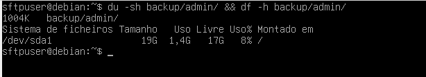


|Observação: O comando acima irá retornar as informações de uso de disco do diretório especificado.|
---

#

Para tratamento do retorno do comando, o backend da aplicação processa o output do comando com regex e retorna as informações de uso de disco para o frontend. O frontend da aplicação exibe as informações de uso de disco do servidor de backup para o usuário.

#### Regex utilizado para processar o output do comando:
```javascript

// Regex para capturar o tamanho do diretório e o uso do disco
    // (?<tm_files>\d+K|\d+G|\d+T) - Tamanho dos arquivos
    // (?<tm_disk>\d+G|\d+T) - Tamanho do disco
    // (?<uso_disk>\d+,\d+G|\d+G|\d+T) - Uso do disco
    // (?<free_disk>\d+G|\d+T) - Espaço livre no disco
    // (?<percent_uso>\d+%|\d+,\d+%) - Porcentagem de uso do disco

    const regex = /^(?<tm_files>\d+K|\d+M|\d+G|\d+T|\d,\d+K|\d,\d+M|\d,\d+G|\d,\d+T).*\s+\S+.*\s+\W+\S+\s+(?<tm_disk>\d+G|\d+T)\s+(?<uso_disk>\d+,\d+G|\d+G|\d+T)\s+(?<free_disk>\d+G|\d+T)\s+(?<percent_uso>\d+%|\d+,\d+%)\s+\W$/gm;

```

#

### Pré-requisitos para execução da aplicação:

- Docker e Docker Compose

### Executando a aplicação:

1. Clone o repositório:
```bash
git clone <url-do-repositorio>
```

2. Acesse o diretório do projeto:
```bash
cd acronis-backup
```

3. Editar o arquivo .env do backend da aplicação com as credenciais de acesso ao banco de dados e ao servidor de backup (Exemplo de arquivo .env):
```bash
DATABASE_URL=""                        # URL de conexão com o banco de dados

JWT_SECRET=""                          # Chave secreta para geração do token JWT
JWT_EXPIRES_IN=""                      # Tempo de expiração do token JWT
JWT_ALGORITHM="HS256"                  # Algoritmo de criptografia do token JWT

BACKUP_SERVER_IP=""                    # IP do servidor de backup
BACKUP_SERVER_PORT=""                  # Porta de conexão com o servidor de backup
BACKUP_SERVER_USERNAME=""              # Usuário de conexão com o servidor de backup
BACKUP_SERVER_PASSWORD=""              # Senha de conexão com o servidor de backup
```

4. No diretório raiz do projeto, execute o comando:
```bash
docker-compose up
```

5. Acesse a aplicação no navegador:
```bash
http://localhost:3000
```

6. Para encerrar a execução da aplicação, execute o comando:
```bash
docker-compose down
```

### Executando a aplicação usando VirtualBox e Vagrant

- Caso você prefira utilizar uma máquina virtual para rodar o projeto, siga as instruções abaixo para configurar o ambiente utilizando VirtualBox e Vagrant.

- Pré-requisitos:

* VirtualBox
* Vagrant

- Passos para execução com VirtualBox e Vagrant:
1. Instale o VirtualBox:
   * Acesse o site oficial do VirtualBox e baixe a versão apropriada para o seu sistema operacional.
   * Siga o guia de instalação fornecido pela página de download.
2. Instale o Vagrant:
   * Baixe e instale o Vagrant de acordo com o sistema operacional.
3. Configurando o Vagrant:
   * No diretório do projeto, crie o arquivo Vagrantfile com a seguinte configuração:
'''bash
# -*- mode: ruby -*-
# vi: set ft=ruby :

Vagrant.configure("2") do |config|

  # Usando a box do Debian Bullseye (Debian 11)
  config.vm.box = "debian/bullseye64"
  config.vm.network "public_network"

  # Configurando a VM (ajuste conforme necessário)
  config.vm.provider "virtualbox" do |vb|
    vb.memory = "2048"  # Memória em MB
    vb.cpus = 2         # Número de CPUs
  end

  # Configurando o nome da máquina
  config.vm.hostname = "debian-servidor"

  # Provisionamento para instalar OpenSSH, criar usuário e ajustar SSH
  config.vm.provision "shell", inline: <<-SHELL
    # Atualiza a lista de pacotes
    apt-get update
    
    # Instala o OpenSSH Server
    apt-get install -y openssh-server

    # Cria o usuário 'acronis' com a senha 'senhaforte'
    useradd -m -s /bin/bash acronis
    echo "acronis:senhaforte" | chpasswd

    # Adiciona o usuário 'acronis' ao grupo 'sudo'
    usermod -aG sudo acronis

    # Permite o login por senha via SSH
    sed -i 's/PasswordAuthentication no/PasswordAuthentication yes/' /etc/ssh/sshd_config
    systemctl restart ssh
  SHELL
  
  # config.vm.network "forwarded_port", guest: 22, host: 2222

  # Configurando pasta sincronizada (opcional)
  # config.vm.synced_folder "./data", "/home/vagrant/data"

end
'''

4. Inicializando a máquina virtual com Vagrant:
   * No diretório do projeto, execute o seguinte comando para iniciar a máquina virtual:
'''bash
vagrant up
'''

5. Conectando-se à máquina virtual:
   * Para acessar a máquina virtual via SSH, use o comando:
'''bash
vagrant ssh
'''

6. Encerrando a máquina virtual:
   * Quando não precisar mais da máquina virtual, você pode pará-la com:
'''bash
vagrant halt
'''

7. Destruindo a máquina virtual (opcional):
   * Para remover completamente a máquina virtual criada, use:
'''bash
vagrant destroy
'''

### Fontes:

- [Express.js](https://expressjs.com/)
- [Prisma](https://www.prisma.io/)
- [JWT](https://jwt.io/)
- [Argon2](https://www.npmjs.com/package/argon2)
- [ssh2-sftp-client](https://www.npmjs.com/package/ssh2-sftp-client)
- [Vite.js](https://vitejs.dev/)
- [Bootstrap](https://getbootstrap.com/)
- [Multer](https://www.npmjs.com/package/multer)
- [Docker](https://www.docker.com/)
- [Docker Compose](https://docs.docker.com/compose/)
